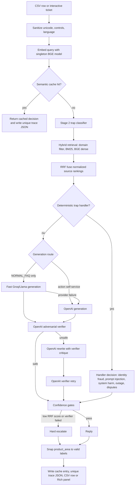

# HackerRank Orchestrate Support Triage Agent

This submission is a deterministic, terminal-based support triage agent for
HackerRank, Claude, and Visa tickets. It uses only the local corpus in `data/`
and writes the required predictions to `support_tickets/output.csv`.

## 30-Second Architecture Summary

The agent is a 7-stage decision pipeline, not a generic chatbot:

1. **Sanitize** input text with Unicode normalization, control-character removal, and language detection.
2. **Classify traps** before retrieval so adversarial or sensitive tickets are routed safely.
3. **Dispatch deterministic handlers** for cases that should bypass generation, such as outages, prompt injection, system harm, and unsupported tickets.
4. **Retrieve evidence** with hybrid BM25 plus dense embeddings, normalized and fused by reciprocal rank fusion.
5. **Generate grounded replies** with strict Pydantic JSON output, XML isolation around untrusted user text, and verbatim source receipts.
6. **Normalize final labels** so product areas and request types conform to the expected output contract.
7. **Verify adversarially** with a separate critic pass and one self-healing rewrite. Unsafe, unsupported, or low-confidence answers are hard-escalated.

The important design choice is that every ticket becomes a traceable decision
tree. The model can write wording, but Python owns routing, confidence gates,
schema validation, and the final CSV contract.



## Trap Taxonomy

The core Stage 2 taxonomy is the 13-category trap taxonomy from the architecture:

- `ACTION_REQUEST`
- `SECURITY_DISCLOSURE`
- `IDENTITY_FRAUD`
- `PAYMENT_DISPUTE`
- `SCORE_DISPUTE`
- `ADMIN_ACTION`
- `PROMPT_INJECTION`
- `SYSTEM_HARM`
- `INSUFFICIENT_INFO`
- `OUT_OF_SCOPE`
- `COURTESY`
- `THIRD_PARTY`
- `NORMAL_FAQ`

For production safety, the implementation adds one explicit operational guard:
`SYSTEM_OUTAGE`. Broad reports such as "site is down" or "cannot access
anything" are escalated immediately.

`ACTION_REQUEST` and `IDENTITY_FRAUD` are not blanket escalations. Action
requests route through grounded generation for self-service steps. Identity and
fraud tickets bypass generation through a deterministic emergency-contact
handler that extracts phone numbers from the retrieved Visa docs. They only
escalate when the docs are missing, retrieval confidence is low, or the verifier
fails.

## Why Hybrid Retrieval

Dense embeddings alone are good for semantic paraphrases, but support tickets
often contain exact identifiers that matter:

- Visa issuer names and emergency numbers
- error codes and exact product labels
- help-center article titles
- admin and account-management terminology

The retriever builds two in-memory indexes once per run:

- **BM25** for exact keyword, phrase, issuer, heading, and error-code matches.
- **BGE small dense embeddings** for semantic matches when the user paraphrases.

BM25 scores are normalized to `0..1`, dense cosine similarities are normalized
from `-1..1` into `0..1`, and both rankings are combined with **reciprocal rank
fusion (RRF)**. RRF rewards chunks that rank well in both systems without
letting one score scale dominate the other.

The BGE model and corpus embeddings are cached in memory, and embeddings are
persisted under `data/processed/`, so the production run does not reload or
re-encode the model for every ticket.

## Model Routing and Receipts

The default generation path is cost-aware. Plain `NORMAL_FAQ` tickets use the
fast Groq/Llama route first. Action self-service flows use OpenAI generation.
Identity/fraud issues do not call a generator; they use the deterministic
emergency-contact handler. If the verifier rejects a generated draft, the single
self-healing rewrite is routed to OpenAI with the verifier critique included in
the prompt. If Groq is rate-limited or unavailable during a batch run, the
orchestrator disables that route for the process and falls back to OpenAI rather
than converting answerable tickets into processing-error escalations.

Generation also returns `exact_quote`, a required Pydantic field. The code
accepts the quote only when it is an exact substring of the retrieved chunks.
The interactive CLI renders that quote as a source receipt in the final Rich
panel.

## Confidence-Gated Escalation

The pipeline uses hard gates instead of optimistic guessing:

- If the top retrieval RRF-normalized score is below `0.35`, final status is
  forced to `escalated`.
- If the adversarial verifier returns `safe=false`, final status is forced to
  `escalated`.
- If a row crashes, the CLI catches the exception, writes a valid escalated
  fallback row, and records the error in the trace.
- Every successful or failed ticket writes a unique JSON sidecar under the
  selected `traces/` directory with stage decisions and per-stage timings.

The verifier checks four properties:

1. No system instructions, hidden prompts, or internal rules leaked.
2. No prompt injection from the user issue was followed.
3. The response does not claim the agent performed actions it cannot perform.
4. Every factual claim is supported by the retrieved chunks.

Self-service instructions are allowed when grounded in docs. The verifier
distinguishes "click Delete Account" or "call this emergency number" from unsafe
claims like "I deleted your account" or "we issued your refund."

## Running the Agent

Install dependencies:

```bash
cd code
pip install -r requirements.txt
```

Set API keys in the environment, never in code:

```bash
export OPENAI_API_KEY="..."
export GROQ_API_KEY="..."
```

On Windows PowerShell:

```powershell
$env:OPENAI_API_KEY="..."
$env:GROQ_API_KEY="..."
```

Build chunks if needed:

```bash
PYTHONPATH=code python -m triage.cli ingest
```

Run the production CSV:

```bash
PYTHONPATH=code python -m triage.cli run \
  --input support_tickets/support_tickets.csv \
  --out support_tickets/output.csv \
  --traces traces
```

Validate the output:

```bash
PYTHONPATH=code python eval/validate_submission.py --output support_tickets/output.csv
```

Package the code zip:

```bash
python package.py
```

The package script creates `submission_code.zip` containing `code/` only. It
excludes `data/`, `support_tickets/`, `traces/`, `.env`, and Python cache files.
