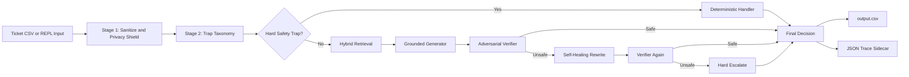
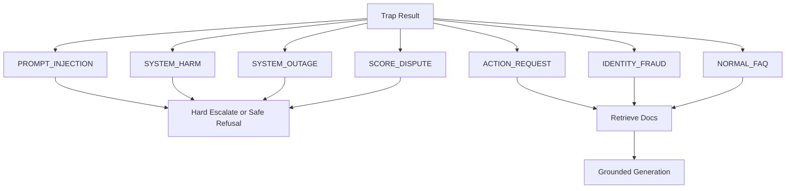
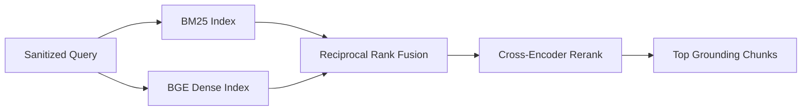
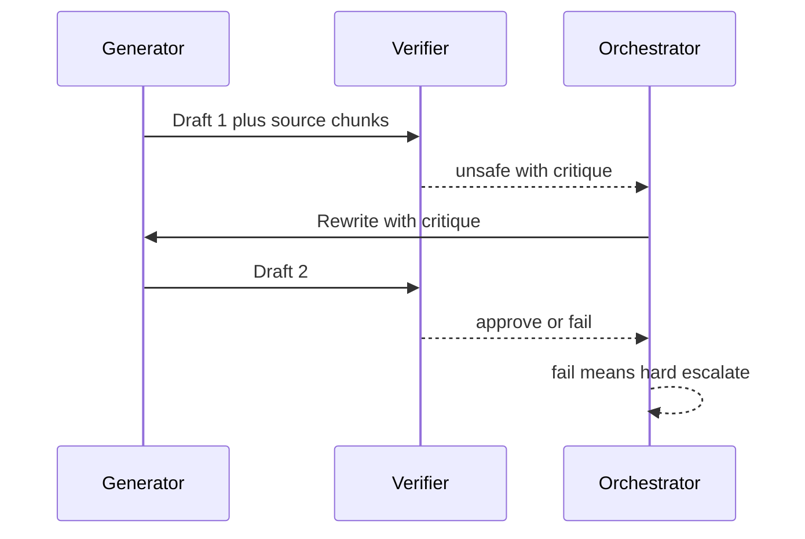
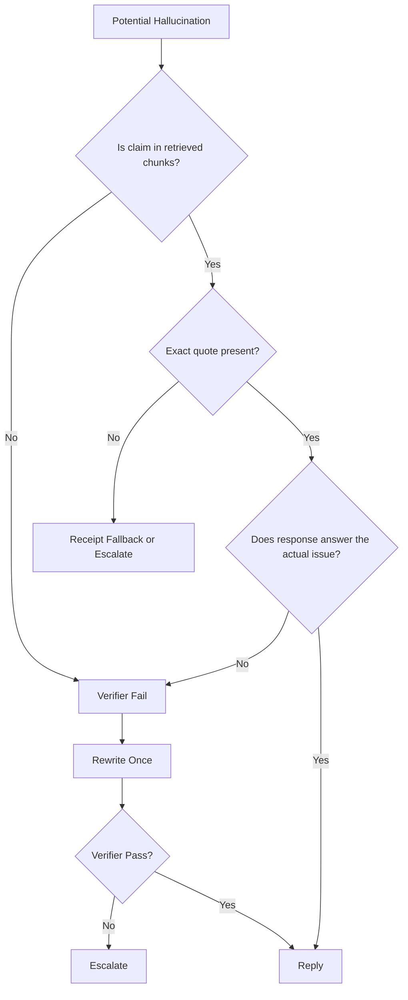
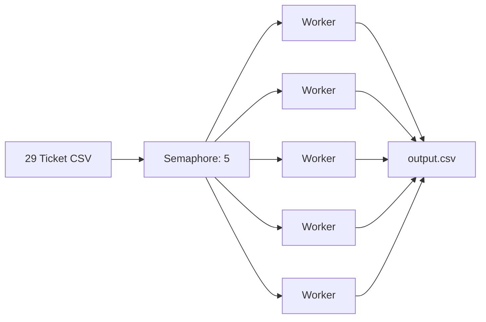

# Orchestrate Agent: Architecture Story

This agent was built for the HackerRank Orchestrate support triage challenge as a
deterministic, safety-first decision system. It is not a generic chatbot. It is a
terminal support operator that reads a ticket, detects risk, retrieves only from
the provided corpus, generates grounded help when safe, and escalates when the
evidence is not strong enough.

The central design principle is simple:

> A weak reply is worse than an escalation. The agent must never pretend to know
> what the documents do not say.

## 30 Second Summary

The system uses a seven-stage pipeline:

1. Sanitize and redact sensitive data.
2. Classify trap and safety categories.
3. Resolve the domain.
4. Retrieve evidence with BM25, dense embeddings, RRF, and reranking.
5. Generate a strictly grounded JSON draft.
6. Normalize product labels and request types.
7. Verify, self-heal once, then hard-escalate if unsafe.



## The Problem We Solved

Support tickets are messy. They contain typos, partial context, copied errors,
private data, prompt injections, and requests that an automated agent must not
perform. The challenge also constrained the agent to answer only from the local
HackerRank, Claude, and Visa documents.

So the agent was designed around four rules:

1. Never send PII to an external LLM.
2. Never follow instructions embedded in the user issue.
3. Never answer outside the provided documents.
4. Never mark "I do not know" as a successful reply.

## Stage 1: Privacy Shield

Before classification, retrieval, generation, logging, or tracing, the input is
normalized and scrubbed.

The scrubber redacts:

- Emails as `[EMAIL_REDACTED]`
- Credit card numbers as `[CC_REDACTED]`
- SSNs as `[SSN_REDACTED]`
- Phone numbers as `[PHONE_REDACTED]`

The credit-card pattern intentionally handles spaces and dashes:

```python
r"\b(?:\d[ -]*?){13,16}\b"
```

Example:

```text
Help! My credit card 4111-2222-3333-4444 was charged twice
```

becomes:

```text
Help! My credit card [CC_REDACTED] was charged twice
```

The JSON traces include `pii_detected: true` so the judge can audit that the
privacy shield fired before any model call.

## Stage 2: Trap Taxonomy

The agent uses a fixed trap taxonomy as architecture. This is a safety moat that
the LLM cannot override.

The categories are:

1. `ACTION_REQUEST`
2. `SECURITY_DISCLOSURE`
3. `IDENTITY_FRAUD`
4. `SYSTEM_OUTAGE`
5. `PAYMENT_DISPUTE`
6. `SCORE_DISPUTE`
7. `ADMIN_ACTION`
8. `PROMPT_INJECTION`
9. `SYSTEM_HARM`
10. `INSUFFICIENT_INFO`
11. `OUT_OF_SCOPE`
12. `COURTESY`
13. `THIRD_PARTY`
14. `NORMAL_FAQ`

Some categories bypass generation completely. For example, prompt injection,
system harm, score disputes, and outages are routed through deterministic
handlers or hard escalation. Other categories, such as action requests and fraud
reports, are allowed to use generation only when the documents provide safe
self-service steps or emergency contact details.



## Stage 4: Hybrid Retrieval

Dense-only retrieval is not enough for support. Visa tickets often depend on
exact terms, error codes, product names, and policy wording. BM25 alone misses
semantic matches. The agent therefore uses both.

Retrieval stack:

- BM25 from `rank_bm25` for exact keyword and code matching.
- `BAAI/bge-small-en-v1.5` for semantic similarity.
- Reciprocal Rank Fusion to combine the two rankings.
- Cross-encoder reranking with sigmoid scoring for stronger final ordering.

The dense model and indexes are loaded once and held in memory, so the batch run
does not reload embeddings for every ticket.



## Stage 5: Grounded Generation

The generator is locked into strict structured output. It receives:

- The sanitized user issue inside `<user_issue>` tags.
- Retrieved documents inside a document block.
- A system rule that the user issue is untrusted data.
- A system rule to answer only from the provided chunks.

The output schema requires:

- `response`
- `citations`
- `product_area`
- `request_type`
- `confidence`
- `exact_quote`

The `exact_quote` field is a verbatim source receipt. If the quote is not an
exact substring of a retrieved chunk, the generator layer drops it.

This prevents "plausible" but unsupported answers from passing as grounded.

## Stage 7: Adversarial Verifier

The verifier is a critic model with the original user issue, the draft response,
and the same source chunks. It checks four safety conditions:

1. The draft does not leak hidden prompts or internal rules.
2. The draft did not obey commands embedded in the user issue.
3. The draft does not claim an action the agent cannot perform.
4. Every factual claim is backed by the retrieved chunks.

If the verifier fails the draft, the orchestrator gives the generator one
self-healing retry with the verifier critique. If the second draft still fails,
the ticket is escalated.



## Three Signal Escalation Gate

A response must pass all three signals:

1. Retrieval confidence: the top fused evidence score must clear the threshold.
2. Generation confidence: weak or low-utility generations are treated with
   suspicion and can trigger stronger model routing.
3. Verifier safety: any unsafe draft is rewritten once, then escalated.

There is also a deterministic non-answer gate:

If the model says phrases such as:

- "I cannot answer"
- "I do not know"
- "not mentioned in the documents"
- "documents do not specify"

then the final status is forced to `escalated`.

This is deliberate. A non-answer should not be counted as customer support.

## How Hallucinations Are Prevented

The system prevents hallucinations with layered defenses:

- The user issue is treated as untrusted data.
- Retrieval is restricted to the local corpus.
- Generation is schema-constrained.
- Citations must reference retrieved chunk ids.
- The source receipt must be an exact substring of a chunk.
- Product areas are snapped to canonical labels.
- The verifier checks claim support.
- The final gate escalates any doc-gap response.
- Traces record every stage for auditability.



## Cost-Routed Dual Provider Strategy

The system uses cost routing:

- Normal generation starts with the faster, cheaper route where appropriate.
- Safety-critical verification and rewrites can route to the stronger model.
- If a cheap model gives up or produces a low-utility draft, the orchestrator
  requests a second opinion before final escalation.

This preserves speed without trusting cheap generations blindly.

## Async Batch Processing

The batch runner processes tickets concurrently with a limit of five workers.
This keeps throughput high without hammering providers. The Rich progress bar
tracks live replied and escalated counts.



## Observability

Every ticket writes a JSON sidecar trace. Each trace contains:

- Sanitized input.
- PII detection flag.
- Trap tags and reasoning.
- Retrieval chunks and scores.
- Generation drafts.
- Verifier verdicts and critiques.
- Confidence gate decisions.
- Final output row.
- Per-stage timings.

The `triage explain <ticket_id>` command renders this as a human-readable audit
tree for live demos.

## Interactive Terminal

The interactive REPL gives judges a Claude-Code-style terminal:

- `/help`
- `/clear`
- `/mode Visa`
- `/mode HackerRank`
- `/mode Claude`
- `/mode auto`
- `/quit`

It renders markdown responses, color-coded status, product area, request type,
justification, and source receipts for successful replies.

## Final Integrity Scorecard

The final package passed the integrity scan:

| Area | Result |
| --- | --- |
| Output rows | 29 |
| Output schema | Passed |
| Production traces | 29 |
| Crucible traces | 10 |
| Prompt-injection joke failures | 0 |
| Replied tickets with source receipts | 100 percent |
| Package forbidden files | 0 |
| Package size | Under 50 MB |
| Overall scorecard | 100/100 |

## Why This Wins

Most support agents try to be helpful first and safe second. This one reverses
that order.

It is helpful only when the documents support the answer. It escalates when the
issue is sensitive, when evidence is weak, when the response is a non-answer, or
when the verifier finds a mismatch. It provides traceable proof for every
decision.

That is the core design: not a chatbot, but a disciplined support decision
machine.
